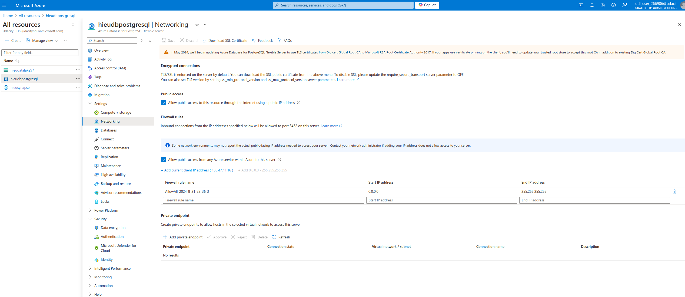
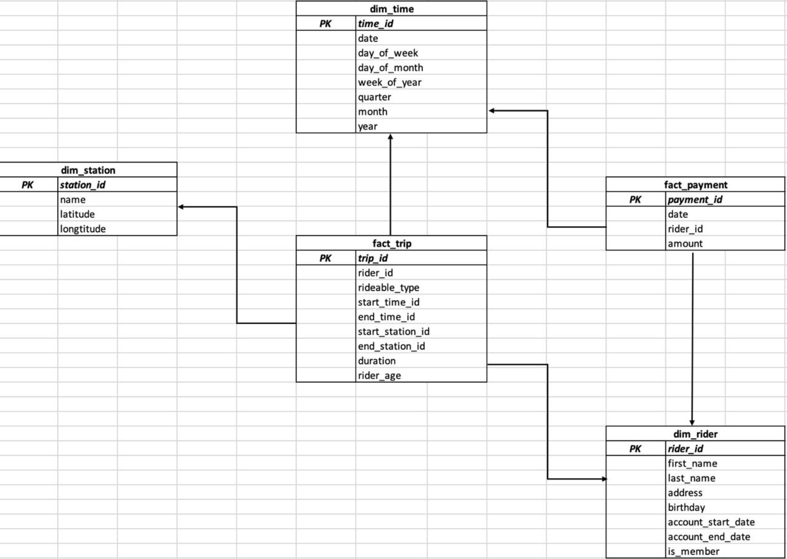
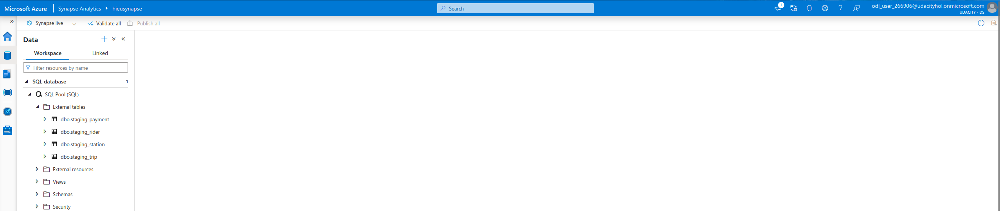

# Building an Azure Data Warehouse for Bike Share Data Analytics
Divvy is a bike sharing program in Chicago, Illinois USA that allows riders to purchase a pass at a kiosk or use a mobile application to unlock a bike at stations around the city and use the bike for a specified amount of time. The bikes can be returned to the same station or to another station. The City of Chicago makes the anonymized bike trip data publicly available for projects like this where we can analyze the data.

### The Goal of this project is to develop a data warehouse solution using Azure Synapse Analytics:
- Design a star schema based on the business outcomes listed below
- Import the data into Synapse.
- Transform the data into the star schema
- and finally, view the report from Analytics.
  
### The business outcomes you are designing for are as follows:
1. Analyze how much time is spend per ride
- Based on date and time factors such as day of week and time of day
- Based on which station is the startin and / or ending station
- Based on age of the rider at time of the ride
- Based on whether the rider is a memeber or a casual rider

2. Analyze how much money is spent
- Per month, quarter, year
- Per member, based on the age of the rider at account start

3. EXTRA CREDIT - Analyze how much money is spent per member
- Based on how many rides the rider averages per month
- Based on how many minutes the rider spends on a bike per month

## Usage
### Task 1: Create Azure resources
1. Create an Azure Database for PostgreSQL. \
   Go to the created database -> Setings -> Networking, then create a firewall as in the image below.
   
2. Create an Azure Synapse workspace.
3. Check the created resources.


### Task 2: Design a star schema


### Task 3: Create the data in PostgreSQL
1. Download the data file [here](https://video.udacity-data.com/topher/2022/March/622a5fc6_azure-data-warehouse-projectdatafiles/azure-data-warehouse-projectdatafiles.zip) and extract it to the folder `data`, which should contains four files: `payments.csv`, `riders.csv`, `stations.csv`, and `trips.csv`.
2. In the Python file `ProjectDataToPostgres.py`, fill in the host, username, and password for PostgreSQL connection.
3. Run:
    ```python
    python3 ProjectDataToPostgres.py
    ```
4. Verify this data exists by using pgAdmin4 (or any similar DBMS tool).


### Task 4: EXTRACT the data from PostgreSQL
In the Azure Synapse workspace, create an ingest wizard to create a one-time pipeline that ingests the data from PostgreSQL into Azure Blob Storage. This will result in all four tables being represented as text files in Blob Storage, ready for loading into the data warehouse.


### Task 5: LOAD the data into external tables in the data warehouse
Once in Blob storage, the files will be shown in the data lake node in the Synapse Workspace. From here, use the script-generating function to load the data from blob storage into external staging tables in the data warehouse created using the serverless SQL Pool.


### Task 6: TRANSFORM the data to the star schema
Go to Develop, create and run the SQL scripts in the folder `Transformation Script`.
